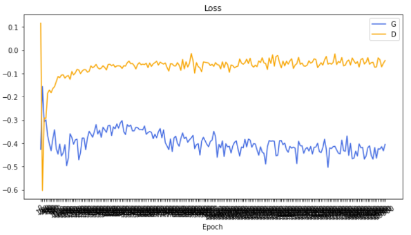
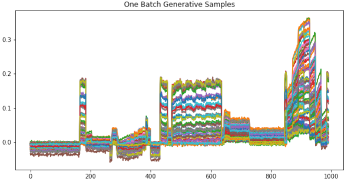
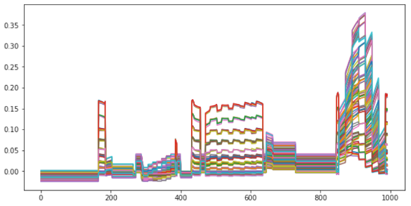
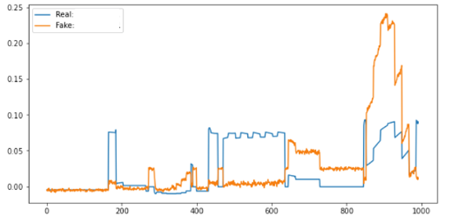
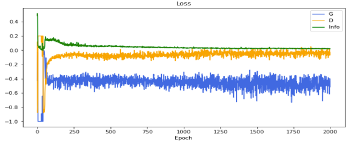
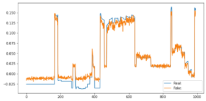

# WGAN
WGAN训练过程损失函数变化如下

训练后的WGAN模型生成1001个样本，如下

而这1001个样本的真实情况，如下

但是，生成样本和原始样本不能对应，例如下图中生成样本和原始样本差距大

# InfoGAN
InfoGAN训练过程损失函数变化如下

大部分生成样本和原始样本可以对应，例如

# Data
df_highdim_points4.csv数值是随机生成

df_name_points4.csv数值是随机生成

# 参考教程
https://www.bilibili.com/video/BV1jY4y1e73G/?spm_id_from=333.1007.top_right_bar_window_custom_collection.content.click
